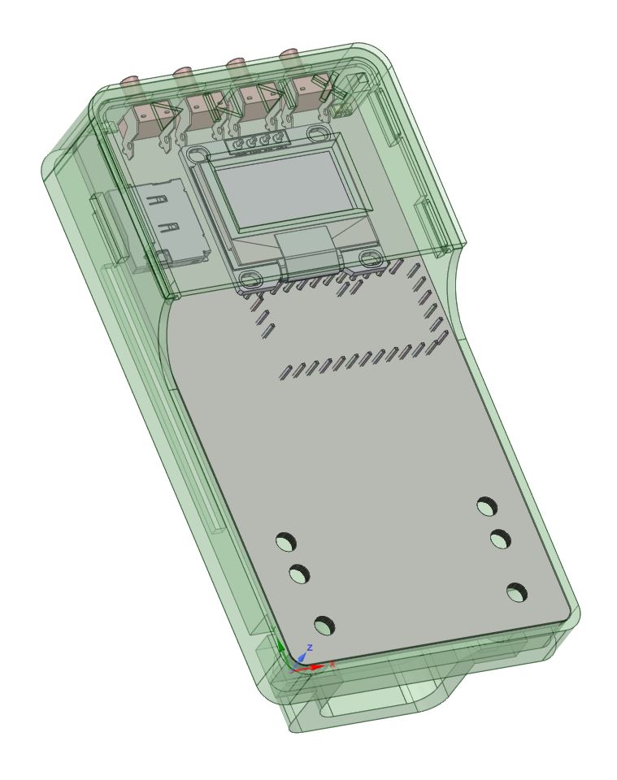

3D printable case for [arananet's Tapunio Reloaded](https://github.com/arananet/Tapuino-Reloaded) v0.3 PCB.  Since all I had was the gerber files for the PCB, I used Gerbview in Kicad 6 to export a new PCB and then added a few footprints for the key components to create a STEP file to model around in [DesignSpark Mechanical](https://www.rs-online.com/designspark/home). The OLED screen used in the "old" style 0.96" one you find on AliExpress with the oval M2 mounting holes. I printed three of the M2x6mm standoffs to space the screen away from the PCB and give it a little more stability.

Also available on [Thingiverse](https://www.thingiverse.com/thing:5585595)

.jpg)

.jpg)

.jpg)

.jpg)

